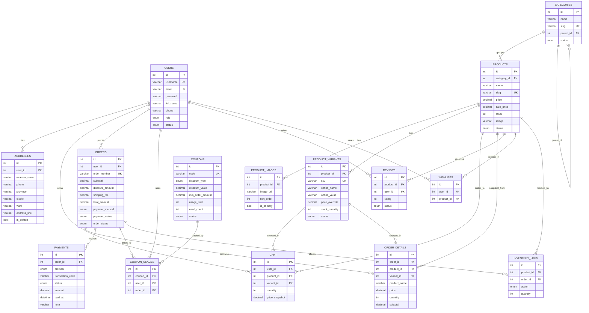

# ERD

Tai lieu nay mo ta cau truc CSDL hien tai cua `webgreenspace` theo `database/schema_revised.sql` va migration `database/alter_payment_status_pending_review.sql`.

## Nhom bang chinh

- Nhom tai khoan: `users`, `addresses`
- Nhom catalog: `categories`, `products`, `product_images`, `product_variants`
- Nhom mua hang: `cart`, `orders`, `order_details`, `payments`
- Nhom marketing va social: `coupons`, `coupon_usages`, `reviews`, `wishlists`
- Nhom kho: `inventory_logs`

## ER Diagram

## Giai thich nghiep vu

- `users` chua role `admin` va `user`; bang nay la diem vao cho auth va phan quyen.
- `addresses` tach rieng de mot user co nhieu dia chi va co `is_default`.
- `products.stock` duoc giu truc tiep tren bang san pham de phu hop scope do an; bien dong kho duoc luu them o `inventory_logs`.
- `cart` la bang gio hang runtime cua user dang dang nhap.
- `orders` luu snapshot giao hang, tong tien, `payment_method`, `payment_status`, `order_status`.
- `order_details` dong vai tro snapshot san pham tai thoi diem dat hang.
- `payments` luu lich su xac nhan thanh toan mo phong, bao gom `pending_review`.
- `coupon_usages`, `reviews`, `wishlists` la cac bang phu tro cho mo rong he thong.

## Rang buoc quan trong

- `users.email`, `users.username`, `products.slug`, `categories.slug`, `orders.order_number`, `product_variants.sku`, `coupons.code` la duy nhat.
- `cart` dung unique key `(user_id, product_id, variant_id)` de tranh trung dong.
- `reviews.rating` co `CHECK (rating >= 1 AND rating <= 5)`.
- `payments.status` va `orders.payment_status` phai ho tro: `unpaid`, `pending_review`, `paid`, `failed`.

## Ket luan

ERD hien tai dap ung duoc cac module da hoan thanh trong checklist: auth, product, cart, checkout, payment mo phong, admin va security.
