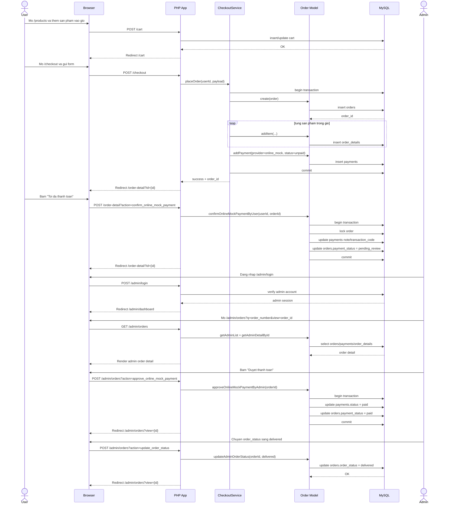

# Sequence Diagram

Tai lieu nay chon luong nghiep vu quan trong nhat cua do an: user dat hang bang `online_mock`, gui xac nhan thanh toan, sau do admin vao duyet va cap nhat trang thai don.

## Actors

- User
- Browser
- PHP App
- CheckoutService
- Order model
- MySQL
- Admin

## Sequence: Checkout + Payment Review

## Diem nghiep vu can nho

- Checkout duoc bao boi transaction de tranh tao don dang do.
- `order_details` luu snapshot gia va thong tin san pham tai thoi diem mua.
- User khong tu chuyen `payment_status` sang `paid`; user chi dua don sang `pending_review`.
- Chi admin moi co quyen approve/reject thanh toan `online_mock`.
- Sau khi thanh toan duoc duyet, admin moi tiep tuc xu ly `order_status`.

## Trang thai duoc su dung

- `payment_status`: `unpaid -> pending_review -> paid` hoac `failed`
- `order_status`: `pending -> confirmed -> processing -> shipping -> delivered`

## Gia tri cua sequence nay

Sequence nay bao phu 3 module quan trong nhat cua do an:

- Dat hang
- Thanh toan mo phong
- Quan tri don hang ben admin
