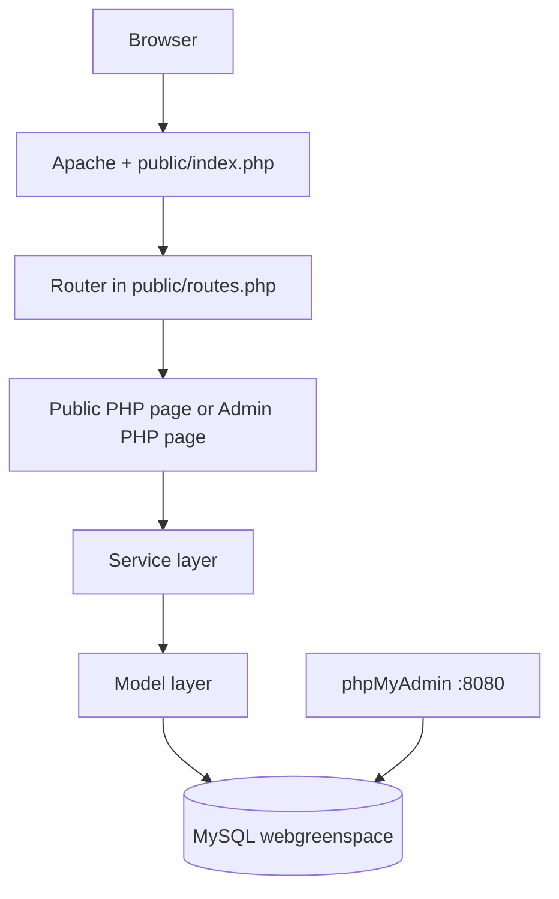

# System Flow

Tai lieu nay mo ta cach WebGreenSpace van hanh tu muc kien truc, route, service den nghiep vu chinh.

## 1. Kien truc tong the

He thong duoc trien khai theo huong monolith:

- `public/` tiep nhan request HTTP
- `public/index.php` la entry point cho clean URL
- `public/routes.php` khai bao route cho user va admin
- `app/services/` chua nghiep vu tai cac luong chinh
- `app/models/` thao tac CSDL bang PDO
- `helpers/functions.php` gom helper auth, csrf, flash, escape, upload
- `config/config.php` nap env, khoi tao session va autoload class

## 2. So do flow muc cao



## 3. Luong theo module

### 3.1 Auth

- User login route: `/login`
- Admin login route: `/admin/login`
- Service chinh: `app/services/AuthService.php`
- Du lieu session sau login:
  - `$_SESSION['user_id']`
  - `$_SESSION['user_role']`
  - `$_SESSION['user_data']`

Flow:

1. User submit form login hoac signup.
2. App validate input.
3. Model lay user theo username/email.
4. Password duoc so sanh bang `password_verify`.
5. Session duoc tao va redirect theo role.

### 3.2 Product va Category

- Route: `/products`, `/product/{slug}`, `/category/{slug}`
- Admin route: `/admin/products`, `/admin/categories`
- Chuc nang:
  - Liet ke
  - Tim kiem / loc
  - CRUD ben admin
  - Quan ly anh va ton kho

### 3.3 Cart

- Route: `/cart`
- Action chinh:
  - them san pham
  - cap nhat so luong
  - xoa san pham
  - lam rong gio

Flow:

1. User them san pham tu page products/detail.
2. App validate `csrf_token`, `product_id`, `quantity`.
3. Cart model update bang `cart`.
4. Giao dien hien tong tien va cho phep dieu chinh so luong.

### 3.4 Checkout va Order

- Route: `/checkout`, `/orders`, `/order-detail`
- Service chinh: `app/services/CheckoutService.php`

Flow:

1. App lay summary tu cart.
2. Validate thong tin nguoi nhan va payment method.
3. Mo transaction.
4. Tao dong `orders`.
5. Tao cac dong `order_details`.
6. Tao dong `payments`.
7. Commit va clear cart.

### 3.5 Payment mo phong

Hai phuong thuc:

- `cod`
- `online_mock`

Flow `online_mock`:

1. Order tao voi `payment_status = unpaid`.
2. User vao `order-detail` bam "Toi da thanh toan".
3. He thong doi sang `pending_review`.
4. Admin vao `/admin/orders` de approve hoac reject.
5. Neu approve thi `payment_status = paid`.
6. Neu reject thi `payment_status = failed`, user co the gui lai yeu cau.

### 3.6 Admin

Khu admin duoc tach route va trang login rieng:

- `/admin/login`
- `/admin/dashboard`
- `/admin/orders`
- `/admin/products`
- `/admin/categories`
- `/admin/users`

Flow bao ve:

1. User thuong vao admin se bi chan.
2. `require_admin()` va `public/admin/bootstrap.php` kiem tra session + role.
3. Neu chua dang nhap thi redirect ve admin login.
4. Neu khong phai admin thi redirect ve trang user.

## 4. Luong trang thai don hang

### Payment status

```text
unpaid -> pending_review -> paid
unpaid -> pending_review -> failed -> pending_review
```

### Order status

```text
pending -> confirmed -> processing -> shipping -> delivered
pending/confirmed/processing/shipping -> cancelled
```

## 5. Thanh phan bao mat da ap dung

- Validate input o auth, checkout, admin form
- CSRF token cho form nhay cam
- PDO prepared statements
- Escape output khi render
- Check role admin cho khu admin
- Validate upload image bang extension + MIME + metadata

## 6. Luong test da verify

Script `tests/run_smoke_tests.ps1` da verify duoc:

1. Dang ky
2. Dang nhap
3. Them va cap nhat gio hang
4. Checkout
5. Xac nhan thanh toan `online_mock`
6. Chan user thuong khoi admin
7. Admin login
8. Admin duyet payment
9. Admin doi `order_status` sang `delivered`

## 7. Ket luan

System flow hien tai da khop voi scope do an backend:

- monolith de demo de nho
- nghiep vu du ro de bao ve
- co route user/admin tach rieng
- co test smoke cho luong kinh doanh quan trong nhat
