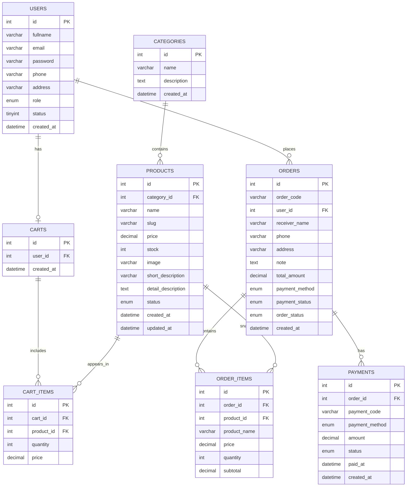
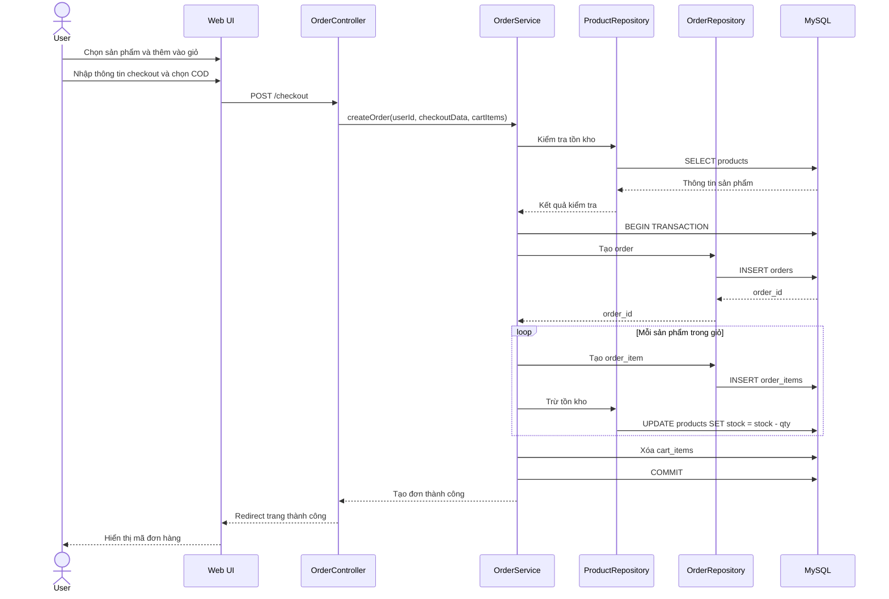
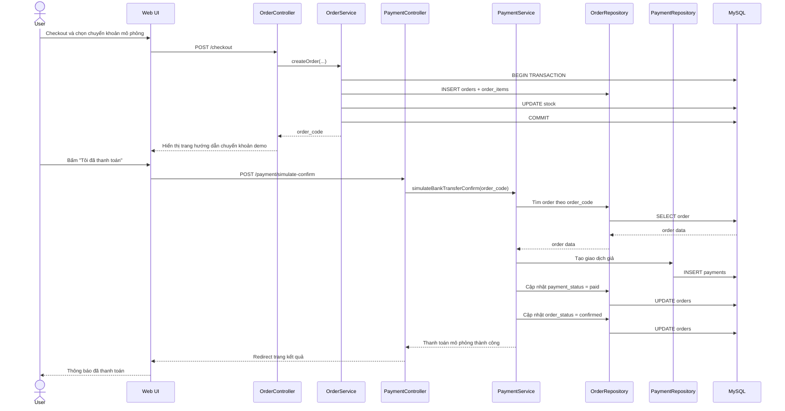
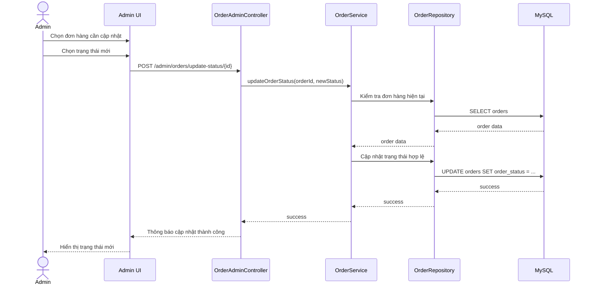

# System Design Chi Tiết – Đồ Án Web Bán Cây Xanh
**Công nghệ:** PHP + MySQL + Docker  
**Phạm vi:** Đồ án học phần, tập trung backend đầy đủ, thanh toán mô phỏng

---

## 1. Mục tiêu hệ thống

Xây dựng một website bán cây xanh có các khả năng chính:

- Người dùng xem sản phẩm, tìm kiếm, lọc theo danh mục
- Đăng ký, đăng nhập, quản lý tài khoản
- Thêm sản phẩm vào giỏ hàng
- Đặt hàng và theo dõi đơn hàng
- Thanh toán theo kiểu mô phỏng, không tích hợp cổng thanh toán thật
- Quản trị viên quản lý sản phẩm, danh mục, người dùng, đơn hàng
- Toàn bộ hệ thống chạy được bằng Docker

### 1.1 Mục tiêu học thuật
Hệ thống cần thể hiện được:
- Phân tích yêu cầu
- Thiết kế cơ sở dữ liệu quan hệ
- Thiết kế backend phân tầng
- Xử lý xác thực, phân quyền
- Xử lý luồng đặt hàng
- Mô phỏng thanh toán
- Triển khai môi trường bằng Docker

### 1.2 Phạm vi
**Có trong phạm vi:**
- CRUD sản phẩm
- CRUD danh mục
- Đăng ký, đăng nhập
- Giỏ hàng
- Đặt hàng
- Thanh toán mô phỏng
- Quản trị đơn hàng
- Docker hóa hệ thống

**Ngoài phạm vi hoặc chỉ mô phỏng:**
- Không dùng cổng thanh toán thật như VNPAY, MoMo, Stripe
- Không cần microservices
- Không cần queue, cache phân tán thật
- Không cần tối ưu cho hàng chục nghìn người dùng đồng thời

---

## 2. Yêu cầu chức năng

## 2.1 Chức năng phía khách và người dùng
1. Xem danh sách cây
2. Xem chi tiết cây
3. Tìm kiếm cây theo tên
4. Lọc theo danh mục
5. Đăng ký tài khoản
6. Đăng nhập, đăng xuất
7. Thêm vào giỏ hàng
8. Cập nhật số lượng trong giỏ
9. Xóa sản phẩm khỏi giỏ
10. Nhập thông tin nhận hàng
11. Tạo đơn hàng
12. Chọn phương thức thanh toán
13. Mô phỏng xác nhận thanh toán
14. Xem lịch sử đơn hàng
15. Xem chi tiết đơn hàng

## 2.2 Chức năng phía admin
1. Quản lý danh mục
2. Quản lý sản phẩm
3. Quản lý hình ảnh sản phẩm
4. Quản lý tồn kho
5. Quản lý đơn hàng
6. Cập nhật trạng thái đơn hàng
7. Cập nhật trạng thái thanh toán nếu cần
8. Quản lý người dùng
9. Xem thống kê cơ bản

---

## 3. Yêu cầu phi chức năng

### 3.1 Bảo mật
- Mật khẩu phải được hash
- Chống SQL Injection bằng PDO prepared statements
- Kiểm tra phân quyền cho từng khu vực
- Kiểm tra dữ liệu đầu vào
- Kiểm soát upload ảnh

### 3.2 Dễ triển khai
- Chạy bằng `docker compose up -d`
- Có file seed dữ liệu mẫu
- Tách biến môi trường khỏi source code

### 3.3 Dễ bảo trì
- Tổ chức code theo mô hình MVC hoặc gần MVC
- Tách controller, service, model, config
- Dùng convention đặt tên rõ ràng

### 3.4 Hiệu năng vừa đủ cho đồ án
- Phân trang danh sách sản phẩm
- Index cho các cột tìm kiếm chính
- Không truy vấn lặp không cần thiết

---

## 4. Kiến trúc tổng thể

Vì đây là đồ án, kiến trúc phù hợp nhất là **Monolithic Web Application**.

## 4.1 Mô hình triển khai
- Nginx/Apache + PHP
- MySQL
- phpMyAdmin
- Toàn bộ chạy bằng Docker Compose

## 4.2 Kiến trúc logic
Hệ thống chia thành các lớp:

1. **Presentation Layer**
   - Giao diện người dùng
   - Admin dashboard
   - Form đăng nhập, giỏ hàng, checkout

2. **Controller Layer**
   - Nhận request
   - Validate cơ bản
   - Gọi service phù hợp
   - Trả về view hoặc JSON

3. **Service Layer**
   - Chứa nghiệp vụ chính
   - Xử lý đặt hàng
   - Xử lý thanh toán mô phỏng
   - Xử lý tính tổng tiền, tồn kho

4. **Repository/Model Layer**
   - Làm việc với MySQL
   - CRUD dữ liệu

5. **Database Layer**
   - MySQL chứa dữ liệu hệ thống

---

## 5. Sơ đồ kiến trúc mức cao

```text
[User Browser]
      |
      v
[PHP Web App]
  | Controller
  | Service
  | Model/Repository
      |
      v
   [MySQL]

[Admin Browser] ----> [PHP Web App] ----> [MySQL]

[phpMyAdmin] -------> [MySQL]
```

---

## 6. Kiến trúc thư mục gợi ý

```text
project/
├─ app/
│  ├─ controllers/
│  │  ├─ AuthController.php
│  │  ├─ ProductController.php
│  │  ├─ CartController.php
│  │  ├─ OrderController.php
│  │  ├─ PaymentController.php
│  │  └─ Admin/
│  │     ├─ ProductAdminController.php
│  │     ├─ OrderAdminController.php
│  │     └─ UserAdminController.php
│  ├─ services/
│  │  ├─ AuthService.php
│  │  ├─ ProductService.php
│  │  ├─ CartService.php
│  │  ├─ OrderService.php
│  │  └─ PaymentService.php
│  ├─ models/
│  │  ├─ User.php
│  │  ├─ Category.php
│  │  ├─ Product.php
│  │  ├─ Cart.php
│  │  ├─ Order.php
│  │  └─ Payment.php
│  ├─ repositories/
│  │  ├─ UserRepository.php
│  │  ├─ ProductRepository.php
│  │  ├─ CartRepository.php
│  │  ├─ OrderRepository.php
│  │  └─ PaymentRepository.php
│  ├─ middleware/
│  │  ├─ AuthMiddleware.php
│  │  └─ AdminMiddleware.php
│  ├─ helpers/
│  │  ├─ Response.php
│  │  ├─ Validator.php
│  │  └─ Upload.php
│  └─ views/
│     ├─ client/
│     └─ admin/
├─ config/
│  ├─ database.php
│  ├─ app.php
│  └─ routes.php
├─ public/
│  ├─ index.php
│  ├─ assets/
│  └─ uploads/
├─ database/
│  ├─ schema.sql
│  └─ seed.sql
├─ docker/
│  ├─ php/
│  │  └─ Dockerfile
│  └─ mysql/
├─ docker-compose.yml
├─ .env
└─ README.md
```

---

## 7. Thiết kế module chi tiết

## 7.1 Module xác thực

### Chức năng
- Đăng ký
- Đăng nhập
- Đăng xuất
- Quản lý session
- Phân quyền admin/user

### Luồng đăng ký
1. Người dùng nhập họ tên, email, mật khẩu, số điện thoại, địa chỉ
2. Backend validate dữ liệu
3. Kiểm tra email đã tồn tại chưa
4. Hash mật khẩu bằng `password_hash`
5. Lưu vào bảng `users`
6. Trả thông báo đăng ký thành công

### Luồng đăng nhập
1. Người dùng nhập email và mật khẩu
2. Backend lấy user theo email
3. Dùng `password_verify`
4. Nếu đúng, tạo session:
   - `user_id`
   - `role`
   - `fullname`
5. Chuyển về trang chủ hoặc dashboard

### Phân quyền
- User thường: mua hàng, xem đơn của chính mình
- Admin: quản trị toàn hệ thống

---

## 7.2 Module danh mục

### Chức năng
- Tạo danh mục
- Sửa danh mục
- Xóa danh mục
- Liệt kê danh mục

### Quy tắc
- Chỉ admin được thao tác
- Nếu danh mục đang có sản phẩm thì nên:
  - Hoặc không cho xóa
  - Hoặc chuyển sản phẩm sang trạng thái chưa phân loại

Khuyến nghị cho đồ án: **không cho xóa nếu còn sản phẩm**

---

## 7.3 Module sản phẩm

### Chức năng
- Xem danh sách sản phẩm
- Xem chi tiết sản phẩm
- Tìm kiếm
- Lọc danh mục
- CRUD sản phẩm

### Thuộc tính sản phẩm
- Tên cây
- Giá
- Tồn kho
- Ảnh
- Mô tả ngắn
- Mô tả chi tiết
- Danh mục
- Trạng thái hiển thị

### Nghiệp vụ
- Chỉ hiển thị sản phẩm `status = active`
- Chỉ cho thêm vào giỏ nếu `stock > 0`
- Giá lưu tại thời điểm hiện tại trong bảng sản phẩm
- Giá lúc đặt đơn phải copy sang `order_items`

---

## 7.4 Module giỏ hàng

### Hai cách triển khai
1. **Session cart** cho khách chưa đăng nhập
2. **Database cart** cho user đã đăng nhập

### Khuyến nghị cho đồ án
- Dùng session cho khách
- Khi user đăng nhập, có thể merge session cart vào database cart

### Nghiệp vụ giỏ hàng
- Thêm sản phẩm
- Cập nhật số lượng
- Xóa sản phẩm
- Tính tổng tiền

### Ràng buộc
- Số lượng thêm không vượt quá tồn kho
- Nếu sản phẩm ngừng kinh doanh, không cho checkout

---

## 7.5 Module đơn hàng

### Chức năng
- Tạo đơn hàng
- Lưu danh sách sản phẩm trong đơn
- Theo dõi trạng thái đơn hàng
- Hiển thị lịch sử đơn hàng

### Trạng thái đơn hàng đề xuất
- `pending`
- `confirmed`
- `shipping`
- `completed`
- `cancelled`

### Quy tắc
- Sau khi tạo đơn, hệ thống lưu snapshot:
  - tên sản phẩm
  - đơn giá
  - số lượng
  - thành tiền
- Không lấy trực tiếp từ bảng sản phẩm khi hiển thị đơn cũ
- Sau khi tạo đơn thành công, giỏ hàng bị xóa

---

## 7.6 Module thanh toán mô phỏng

Đây là điểm quan trọng nhất để phù hợp yêu cầu đồ án.

### Phương thức thanh toán
- `cod`: thanh toán khi nhận hàng
- `bank_transfer_fake`: chuyển khoản mô phỏng

### Trạng thái thanh toán
- `unpaid`
- `paid`

### Luồng COD
1. User tạo đơn
2. Chọn `cod`
3. Hệ thống:
   - tạo đơn
   - `payment_status = unpaid`
   - `order_status = pending`
4. Admin sẽ xử lý tiếp đơn hàng

### Luồng chuyển khoản mô phỏng
1. User tạo đơn
2. Chọn `bank_transfer_fake`
3. Hệ thống hiển thị thông tin giả lập:
   - Ngân hàng: MB Bank
   - Số tài khoản: 0123456789
  - Chủ tài khoản: WEB BÁN CÂY DEMO
   - Nội dung: `THANHTOAN_DON_<ORDER_CODE>`
4. User bấm nút **Tôi đã thanh toán**
5. Hệ thống:
   - sinh mã giao dịch giả
   - ghi vào bảng `payments`
   - cập nhật `payment_status = paid`
   - có thể cập nhật `order_status = confirmed`

### Lưu ý
Không cần gọi API ngân hàng thật.  
Chỉ cần mô phỏng bằng form/nút bấm là đủ.

---

## 8. Thiết kế cơ sở dữ liệu

## 8.1 Danh sách bảng
1. users
2. categories
3. products
4. carts
5. cart_items
6. orders
7. order_items
8. payments

---

## 8.2 Chi tiết bảng

## Bảng `users`

| Tên cột | Kiểu | Ràng buộc | Ý nghĩa |
|---|---|---|---|
| id | INT | PK, AI | Khóa chính |
| fullname | VARCHAR(100) | NOT NULL | Họ tên |
| email | VARCHAR(150) | UNIQUE, NOT NULL | Email đăng nhập |
| password | VARCHAR(255) | NOT NULL | Mật khẩu đã hash |
| phone | VARCHAR(20) | NULL | SĐT |
| address | VARCHAR(255) | NULL | Địa chỉ |
| role | ENUM('admin','user') | DEFAULT 'user' | Vai trò |
| status | TINYINT | DEFAULT 1 | 1 hoạt động, 0 khóa |
| created_at | DATETIME | DEFAULT CURRENT_TIMESTAMP | Thời gian tạo |

## Bảng `categories`

| Tên cột | Kiểu | Ràng buộc | Ý nghĩa |
|---|---|---|---|
| id | INT | PK, AI | Khóa chính |
| name | VARCHAR(100) | UNIQUE, NOT NULL | Tên danh mục |
| description | TEXT | NULL | Mô tả |
| created_at | DATETIME | DEFAULT CURRENT_TIMESTAMP | Thời gian tạo |

## Bảng `products`

| Tên cột | Kiểu | Ràng buộc | Ý nghĩa |
|---|---|---|---|
| id | INT | PK, AI | Khóa chính |
| category_id | INT | FK | Danh mục |
| name | VARCHAR(150) | NOT NULL | Tên cây |
| slug | VARCHAR(180) | UNIQUE | Đường dẫn đẹp |
| price | DECIMAL(12,2) | NOT NULL | Giá bán |
| stock | INT | DEFAULT 0 | Tồn kho |
| image | VARCHAR(255) | NULL | Ảnh đại diện |
| short_description | VARCHAR(255) | NULL | Mô tả ngắn |
| detail_description | TEXT | NULL | Mô tả chi tiết |
| status | ENUM('active','inactive') | DEFAULT 'active' | Trạng thái |
| created_at | DATETIME | DEFAULT CURRENT_TIMESTAMP | Thời gian tạo |
| updated_at | DATETIME | DEFAULT CURRENT_TIMESTAMP ON UPDATE CURRENT_TIMESTAMP | Cập nhật |

## Bảng `carts`

| Tên cột | Kiểu | Ràng buộc |
|---|---|---|
| id | INT | PK, AI |
| user_id | INT | FK, UNIQUE |
| created_at | DATETIME | DEFAULT CURRENT_TIMESTAMP |

## Bảng `cart_items`

| Tên cột | Kiểu | Ràng buộc |
|---|---|---|
| id | INT | PK, AI |
| cart_id | INT | FK |
| product_id | INT | FK |
| quantity | INT | NOT NULL |
| price | DECIMAL(12,2) | NOT NULL |

## Bảng `orders`

| Tên cột | Kiểu | Ràng buộc | Ý nghĩa |
|---|---|---|---|
| id | INT | PK, AI | Khóa chính |
| order_code | VARCHAR(30) | UNIQUE | Mã đơn hàng |
| user_id | INT | FK | Người đặt |
| receiver_name | VARCHAR(100) | NOT NULL | Người nhận |
| phone | VARCHAR(20) | NOT NULL | SĐT |
| address | VARCHAR(255) | NOT NULL | Địa chỉ nhận |
| note | TEXT | NULL | Ghi chú |
| total_amount | DECIMAL(12,2) | NOT NULL | Tổng tiền |
| payment_method | ENUM('cod','bank_transfer_fake') | NOT NULL | Cách thanh toán |
| payment_status | ENUM('unpaid','paid') | DEFAULT 'unpaid' | Trạng thái thanh toán |
| order_status | ENUM('pending','confirmed','shipping','completed','cancelled') | DEFAULT 'pending' | Trạng thái đơn |
| created_at | DATETIME | DEFAULT CURRENT_TIMESTAMP | Tạo đơn |

## Bảng `order_items`

| Tên cột | Kiểu | Ràng buộc |
|---|---|---|
| id | INT | PK, AI |
| order_id | INT | FK |
| product_id | INT | FK |
| product_name | VARCHAR(150) | NOT NULL |
| price | DECIMAL(12,2) | NOT NULL |
| quantity | INT | NOT NULL |
| subtotal | DECIMAL(12,2) | NOT NULL |

## Bảng `payments`

| Tên cột | Kiểu | Ràng buộc |
|---|---|---|
| id | INT | PK, AI |
| order_id | INT | FK |
| payment_code | VARCHAR(40) | UNIQUE |
| payment_method | ENUM('cod','bank_transfer_fake') | NOT NULL |
| amount | DECIMAL(12,2) | NOT NULL |
| status | ENUM('pending','paid','failed') | DEFAULT 'pending' |
| paid_at | DATETIME | NULL |
| created_at | DATETIME | DEFAULT CURRENT_TIMESTAMP |

---

## 8.3 Quan hệ giữa các bảng

- `categories` 1 - n `products`
- `users` 1 - 1 `carts`
- `carts` 1 - n `cart_items`
- `users` 1 - n `orders`
- `orders` 1 - n `order_items`
- `orders` 1 - n `payments` hoặc 1 - 1 tùy thiết kế

Khuyến nghị cho đồ án: xem `orders` và `payments` là **1 - 1 logic**, nhưng cho phép 1 - n để linh hoạt.

---

## 8.4 Chỉ mục nên có
- Index `users.email`
- Index `products.name`
- Index `products.category_id`
- Index `orders.user_id`
- Index `orders.order_code`
- Index `orders.order_status`
- Index `orders.payment_status`
- Index `payments.payment_code`

---

## 9. Thiết kế API hoặc route

## 9.1 Auth
- `GET /register`
- `POST /register`
- `GET /login`
- `POST /login`
- `POST /logout`

## 9.2 Product
- `GET /products`
- `GET /products/{slug}`
- `GET /search?q=...`
- `GET /category/{id}`

## 9.3 Cart
- `GET /cart`
- `POST /cart/add`
- `POST /cart/update`
- `POST /cart/remove`

## 9.4 Checkout & Order
- `GET /checkout`
- `POST /checkout`
- `GET /orders`
- `GET /orders/{order_code}`

## 9.5 Payment
- `GET /payment/{order_code}`
- `POST /payment/simulate-confirm`

## 9.6 Admin
- `GET /admin`
- `GET /admin/products`
- `POST /admin/products/store`
- `POST /admin/products/update/{id}`
- `POST /admin/products/delete/{id}`
- `GET /admin/orders`
- `POST /admin/orders/update-status/{id}`
- `GET /admin/users`

---

## 10. Luồng nghiệp vụ chi tiết

## 10.1 Luồng xem sản phẩm
1. User mở trang chủ
2. Controller gọi ProductService
3. Service truy vấn ProductRepository
4. Lấy danh sách sản phẩm active
5. Render ra giao diện

## 10.2 Luồng thêm giỏ hàng
1. User bấm thêm vào giỏ
2. Backend nhận `product_id`, `quantity`
3. Kiểm tra sản phẩm tồn tại
4. Kiểm tra sản phẩm active
5. Kiểm tra tồn kho
6. Nếu chưa có trong giỏ thì thêm mới
7. Nếu đã có thì cộng dồn số lượng
8. Trả thông báo thành công

## 10.3 Luồng checkout
1. User mở trang checkout
2. Hệ thống đọc giỏ hàng
3. Kiểm tra giỏ hàng không rỗng
4. Kiểm tra lại tồn kho từng sản phẩm
5. User nhập thông tin nhận hàng
6. User chọn `payment_method`
7. Backend tạo đơn hàng trong transaction
8. Backend tạo order_items
9. Backend trừ tồn kho
10. Xóa giỏ hàng
11. Điều hướng sang trang thanh toán hoặc trang thành công

## 10.4 Luồng thanh toán mô phỏng
1. Nếu COD:
   - hiển thị thông báo đặt hàng thành công
2. Nếu chuyển khoản mô phỏng:
   - hiển thị hướng dẫn chuyển khoản demo
   - user bấm nút xác nhận
   - backend ghi payment
   - backend cập nhật `payment_status = paid`

## 10.5 Luồng admin xử lý đơn
1. Admin xem danh sách đơn
2. Mở chi tiết đơn
3. Cập nhật trạng thái từ:
   - pending -> confirmed
   - confirmed -> shipping
   - shipping -> completed
4. Có thể hủy đơn nếu cần

---

## 11. Sequence diagram dạng mô tả

## 11.1 Đặt hàng COD

```text
User -> Product Page: Chọn cây
User -> Cart: Thêm vào giỏ
User -> Checkout: Nhập thông tin
Checkout -> OrderController: Gửi form
OrderController -> OrderService: createOrder()
OrderService -> DB: insert orders
OrderService -> DB: insert order_items
OrderService -> DB: update products stock
OrderService -> DB: clear cart
OrderService -> OrderController: success
OrderController -> User: Hiển thị "Đặt hàng thành công"
```

## 11.2 Thanh toán chuyển khoản mô phỏng

```text
User -> Checkout: Chọn bank_transfer_fake
Checkout -> OrderController: Gửi form
OrderController -> OrderService: createOrder()
OrderService -> DB: insert order
OrderController -> Payment Page: Hiển thị thông tin chuyển khoản demo
User -> Payment Page: Bấm "Tôi đã thanh toán"
Payment Page -> PaymentController: simulateConfirm(order_code)
PaymentController -> PaymentService: confirmFakePayment()
PaymentService -> DB: insert payment
PaymentService -> DB: update orders.payment_status = paid
PaymentService -> DB: update orders.order_status = confirmed
PaymentController -> User: Hiển thị "Thanh toán mô phỏng thành công"
```

---

## 12. Thiết kế lớp nghiệp vụ

## 12.1 AuthService
**Trách nhiệm:**
- Đăng ký user
- Đăng nhập
- Hash mật khẩu
- Kiểm tra quyền

**Các hàm đề xuất:**
- `register(array $data)`
- `login(string $email, string $password)`
- `logout()`
- `checkAdmin()`

## 12.2 ProductService
**Trách nhiệm:**
- Lấy danh sách sản phẩm
- Tìm kiếm
- Kiểm tra tồn kho

**Các hàm:**
- `getAllProducts($filters = [])`
- `getProductById(int $id)`
- `getProductBySlug(string $slug)`
- `createProduct(array $data)`
- `updateProduct(int $id, array $data)`
- `deleteProduct(int $id)`

## 12.3 CartService
**Trách nhiệm:**
- Quản lý giỏ hàng session hoặc DB

**Các hàm:**
- `getCart()`
- `addItem(int $productId, int $qty)`
- `updateItem(int $productId, int $qty)`
- `removeItem(int $productId)`
- `calculateTotal()`
- `clearCart()`

## 12.4 OrderService
**Trách nhiệm:**
- Tạo đơn hàng
- Kiểm tra dữ liệu checkout
- Trừ tồn kho
- Transaction

**Các hàm:**
- `validateCheckoutData(array $data)`
- `createOrder(int $userId, array $checkoutData, array $cartItems)`
- `getOrdersByUser(int $userId)`
- `getOrderDetail(string $orderCode)`
- `updateOrderStatus(int $orderId, string $status)`

## 12.5 PaymentService
**Trách nhiệm:**
- Xử lý thanh toán mô phỏng
- Ghi log thanh toán
- Cập nhật trạng thái đơn

**Các hàm:**
- `generatePaymentCode()`
- `simulateBankTransferConfirm(string $orderCode)`
- `markOrderAsPaid(int $orderId)`

---

## 13. Giao dịch cơ sở dữ liệu

Phần tạo đơn phải dùng **transaction**.

### Tại sao cần transaction
Nếu hệ thống đã insert `orders` nhưng chưa insert xong `order_items`, hoặc trừ tồn kho bị lỗi, dữ liệu sẽ bị sai lệch.

### Phạm vi transaction cho tạo đơn
1. Insert `orders`
2. Insert `order_items`
3. Update `products.stock`
4. Xóa `cart_items`
5. Commit

Nếu có lỗi:
- Rollback toàn bộ

Pseudo flow:

```php
try {
    $pdo->beginTransaction();

    // insert order
    // insert order items
    // update stock
    // clear cart

    $pdo->commit();
} catch (Exception $e) {
    $pdo->rollBack();
}
```

---

## 14. Bảo mật hệ thống

## 14.1 Xác thực
- Mật khẩu hash bằng `password_hash`
- Không lưu mật khẩu thuần

## 14.2 SQL Injection
- Dùng PDO prepared statements
- Không nối chuỗi SQL trực tiếp từ input người dùng

## 14.3 XSS
- Escape output bằng `htmlspecialchars`

## 14.4 CSRF
Với đồ án có thể thêm token đơn giản cho form POST quan trọng:
- đăng nhập
- đăng ký
- checkout
- cập nhật đơn admin

## 14.5 Upload file
- Chỉ cho upload ảnh
- Kiểm tra phần mở rộng
- Kiểm tra MIME type
- Đổi tên file tránh trùng
- Không dùng tên file gốc trực tiếp

## 14.6 Session security
- Regenerate session sau login
- Kiểm tra session timeout nếu muốn

---

## 15. Thiết kế Docker

## 15.1 Các container
1. `app`
2. `db`
3. `phpmyadmin`

## 15.2 Luồng chạy
- Người dùng truy cập cổng web
- PHP app kết nối MySQL qua network nội bộ Docker
- phpMyAdmin quản trị database phục vụ demo

## 15.3 `docker-compose.yml` gợi ý

```yaml
version: "3.8"

services:
  app:
    build:
      context: .
      dockerfile: ./docker/php/Dockerfile
    container_name: plant_shop_app
    ports:
      - "8080:80"
    volumes:
      - ./:/var/www/html
    depends_on:
      - db
    environment:
      DB_HOST: db
      DB_NAME: web_ban_cay
      DB_USER: root
      DB_PASSWORD: root

  db:
    image: mysql:8.0
    container_name: plant_shop_db
    restart: always
    environment:
      MYSQL_DATABASE: web_ban_cay
      MYSQL_ROOT_PASSWORD: root
    ports:
      - "3306:3306"
    volumes:
      - db_data:/var/lib/mysql
      - ./database/schema.sql:/docker-entrypoint-initdb.d/01_schema.sql
      - ./database/seed.sql:/docker-entrypoint-initdb.d/02_seed.sql

  phpmyadmin:
    image: phpmyadmin/phpmyadmin
    container_name: plant_shop_pma
    restart: always
    ports:
      - "8081:80"
    environment:
      PMA_HOST: db
      MYSQL_ROOT_PASSWORD: root
    depends_on:
      - db

volumes:
  db_data:
```

## 15.4 Dockerfile gợi ý

```dockerfile
FROM php:8.2-apache

RUN docker-php-ext-install pdo pdo_mysql mysqli
RUN a2enmod rewrite

WORKDIR /var/www/html
```

---

## 16. Thiết kế cấu hình môi trường

File `.env`:

```env
APP_NAME=PlantShop
APP_ENV=local
APP_URL=http://localhost:8080

DB_HOST=db
DB_PORT=3306
DB_NAME=web_ban_cay
DB_USER=root
DB_PASSWORD=root
```

File `config/database.php` đọc biến môi trường và khởi tạo PDO.

---

## 17. Xử lý lỗi và logging

### 17.1 Các lỗi cần xử lý
- Sai thông tin đăng nhập
- Email đã tồn tại
- Sản phẩm không tồn tại
- Hết hàng
- Giỏ hàng trống
- Checkout thất bại
- Upload file không hợp lệ

### 17.2 Logging
Cho đồ án, chỉ cần:
- Ghi lỗi PHP vào log file
- Ghi exception order/payment vào file riêng nếu muốn

Ví dụ:
- `storage/logs/app.log`
- `storage/logs/payment.log`

---

## 18. Tính toàn vẹn dữ liệu

### Quy tắc quan trọng
1. Email là duy nhất
2. Mỗi user có tối đa 1 cart
3. Không cho quantity <= 0
4. Không cho stock âm
5. Đơn hàng phải có ít nhất 1 order item
6. Không được confirm thanh toán nếu đơn không tồn tại

### Kiểm tra ở 2 tầng
- Tầng application
- Tầng database bằng constraint hợp lý

---

## 19. Kịch bản dữ liệu mẫu

### Danh mục
- Cây để bàn
- Cây phong thủy
- Cây ngoài trời
- Chậu cây mini
- Phụ kiện chăm sóc cây

### Sản phẩm mẫu
- Cây kim tiền
- Cây lưỡi hổ
- Cây sen đá
- Cây trầu bà
- Cây monstera
- Cây phát tài
- Cây ngọc ngân

### User mẫu
- 1 admin
- 3 user thường

### Đơn hàng mẫu
- 3 đơn COD
- 2 đơn chuyển khoản mô phỏng

---

## 20. Mô hình dữ liệu ERD dạng text

```text
users (1) -------- (1) carts
users (1) -------- (n) orders
categories (1) --- (n) products
carts (1) -------- (n) cart_items
products (1) ----- (n) cart_items
orders (1) ------- (n) order_items
products (1) ----- (n) order_items
orders (1) ------- (n) payments
```

---

## 21. Use case chính

## User
- Đăng ký tài khoản
- Đăng nhập
- Xem sản phẩm
- Tìm kiếm sản phẩm
- Thêm vào giỏ hàng
- Thanh toán mô phỏng
- Xem đơn hàng

## Admin
- Đăng nhập admin
- Quản lý danh mục
- Quản lý sản phẩm
- Quản lý đơn hàng
- Quản lý người dùng

---

## 22. Thiết kế giao diện theo màn hình backend cần hỗ trợ

### Client
- Trang chủ
- Danh sách sản phẩm
- Chi tiết sản phẩm
- Giỏ hàng
- Checkout
- Thanh toán mô phỏng
- Lịch sử đơn hàng
- Chi tiết đơn hàng

### Admin
- Dashboard
- Quản lý sản phẩm
- Form thêm sản phẩm
- Quản lý danh mục
- Quản lý đơn hàng
- Quản lý user

---

## 23. Đề xuất workflow phát triển

### Giai đoạn 1: nền tảng
- Docker
- Kết nối database
- Tạo schema
- Seed dữ liệu

### Giai đoạn 2: auth
- Đăng ký
- Đăng nhập
- Session
- Phân quyền

### Giai đoạn 3: sản phẩm
- Danh mục
- Sản phẩm
- Tìm kiếm
- Lọc

### Giai đoạn 4: giỏ hàng
- Add/update/remove
- Hiển thị tổng tiền

### Giai đoạn 5: đặt hàng
- Form checkout
- Tạo order
- Tạo order items
- Trừ kho

### Giai đoạn 6: thanh toán mô phỏng
- COD
- Chuyển khoản demo
- Ghi payment

### Giai đoạn 7: admin
- Quản lý đơn
- Quản lý user
- Dashboard đơn giản

---

## 24. Kiểm thử hệ thống

## 24.1 Test chức năng
- Đăng ký thành công
- Đăng ký trùng email
- Đăng nhập đúng
- Đăng nhập sai
- Thêm giỏ hàng thành công
- Thêm vượt tồn kho
- Checkout khi giỏ rỗng
- Checkout thành công
- Thanh toán COD
- Thanh toán mô phỏng
- Admin cập nhật trạng thái đơn

## 24.2 Test dữ liệu
- Sau checkout, stock giảm đúng
- Sau checkout, cart rỗng
- Sau confirm payment, payment_status đúng

## 24.3 Test phân quyền
- User không vào được `/admin`
- User không xem được đơn của người khác

---

## 25. Rủi ro và cách xử lý

### Rủi ro 1: Trừ kho sai
**Nguyên nhân:** Không dùng transaction  
**Giải pháp:** Gói create order trong transaction

### Rủi ro 2: User sửa giá ở client
**Nguyên nhân:** Tin dữ liệu từ form  
**Giải pháp:** Giá phải lấy lại từ DB ở server

### Rủi ro 3: Upload file độc hại
**Giải pháp:** Chỉ chấp nhận ảnh hợp lệ, đổi tên file

### Rủi ro 4: User truy cập trái phép admin
**Giải pháp:** Middleware kiểm tra role

### Rủi ro 5: Dữ liệu đơn hàng sai khi sản phẩm đổi giá
**Giải pháp:** Lưu snapshot vào `order_items`

---

## 26. Hướng mở rộng sau đồ án

- Tích hợp thanh toán thật
- Thêm voucher giảm giá
- Thêm đánh giá sản phẩm
- Thêm API REST riêng cho frontend SPA
- Tách frontend và backend
- Thêm Redis cache
- Thêm email xác nhận đơn hàng
- Thêm thống kê doanh thu theo ngày/tháng

---

## 27. Kết luận kiến trúc

Đây là một thiết kế phù hợp cho đồ án vì:
- Đủ đầy các nghiệp vụ thương mại điện tử cơ bản
- Thanh toán được mô phỏng đúng yêu cầu trường học
- Cấu trúc rõ ràng, dễ trình bày khi bảo vệ
- Docker giúp dễ demo và triển khai
- MySQL phù hợp dữ liệu quan hệ
- PHP phù hợp mức độ đồ án và dễ hiện thực hóa

Hệ thống có thể được đánh giá tốt nếu nhóm trình bày rõ:
- Kiến trúc monolithic phân tầng
- Luồng đặt hàng bằng transaction
- Phân quyền admin/user
- Mô hình dữ liệu hợp lý
- Thanh toán mô phỏng nhưng vẫn đúng logic thực tế

---

## 28. Tóm tắt rất ngắn để đưa vào slide

- Kiến trúc monolithic gồm PHP app + MySQL + Docker
- Backend chia các lớp: Controller, Service, Repository, Model
- Các module chính: Auth, Product, Cart, Order, Payment
- Thanh toán chỉ mô phỏng với COD và chuyển khoản giả lập
- Đặt hàng dùng transaction để đảm bảo toàn vẹn dữ liệu
- Admin quản lý sản phẩm, đơn hàng, người dùng
- Hệ thống triển khai bằng Docker Compose


## 29. ERD bằng Mermaid



## 30. Sequence Diagram bằng Mermaid

### 30.1 Đặt hàng COD



### 30.2 Chuyển khoản mô phỏng



### 30.3 Admin cập nhật trạng thái đơn


